# Dockerisation d'une application Node.js et MySQL

Travail réalisé en groupe dans le cadre du TP « Introduction à Docker » (ESGIS, Licence 2 Sécurité Informatique, année 2025-2026).

L'objectif : faire tourner une application web avec sa base de données dans des conteneurs Docker, et prouver que les données survivent à la suppression des conteneurs.

> **À propos de l'application.** L'application CRUD (gestion d'inventaire de produits, Node.js, Express, EJS, MySQL) a été **fournie par l'enseignant** et n'a pas été modifiée. Mon travail porte sur sa **dockerisation** : le `Dockerfile`, le `docker-compose.yml`, le réseau, le volume et les preuves de fonctionnement.

## Ce qui a été réalisé

- Un **réseau Docker** dédié, `l2si`, pour que l'application retrouve la base par son nom (`db`).
- Un **volume nommé**, `db-data`, monté sur `/var/lib/mysql` pour conserver les données de MySQL.
- Un **Dockerfile** qui construit l'image `crud-app:1.0` à partir de Node.js 20.18.1.
- Un conteneur **`db`** (image officielle MySQL 8.0) et un conteneur **`crud-app`**.
- Un fichier **`docker-compose.yml`** qui relance toute l'infrastructure en une seule commande.
- La **preuve de persistance** : un produit ajouté avant la suppression des conteneurs est toujours présent après `docker compose`.

## Architecture

```
Navigateur ──► crud-app (Node.js, port 3000) ──► db (MySQL 8.0)
                       └──────── réseau l2si ────────┘
                                                     │
                                        volume db-data (/var/lib/mysql)
```

## Lancer le projet

Prérequis : Docker et Docker Compose installés.

```bash
cd single-crud-nodejs-mysql
docker volume create db-data
docker compose up -d --build
```

Le volume `db-data` est déclaré comme volume externe dans le `docker-compose.yml` : il faut donc le créer une fois avant le premier lancement.

Ouvre ensuite <http://localhost:3000>. L'application crée elle-même la base `inventory`, la table `products` et trois produits de démonstration au démarrage.

Pour arrêter les conteneurs sans perdre les données :

```bash
docker compose down
```

Pour supprimer aussi les données : `docker volume rm db-data`.

## Captures d'écran

Les captures se trouvent dans le dossier [`single-crud-nodejs-mysql/captures`](single-crud-nodejs-mysql/captures).

**Construction de l'image et vérification**

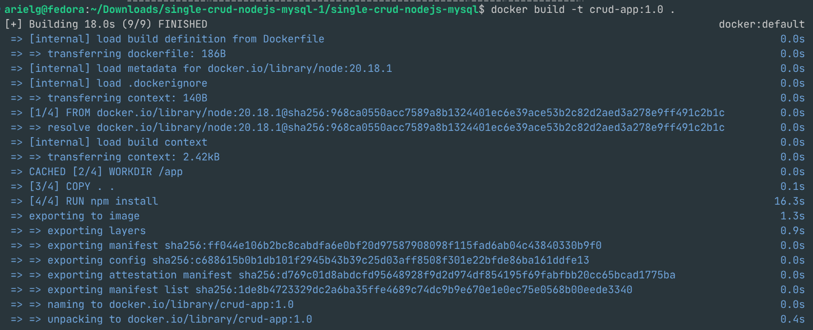
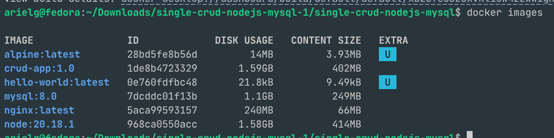

**Réseau et volume**

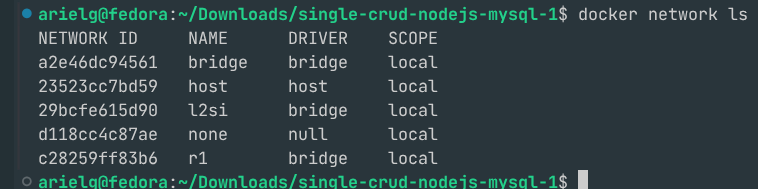
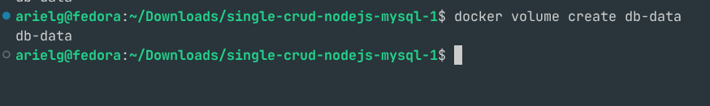
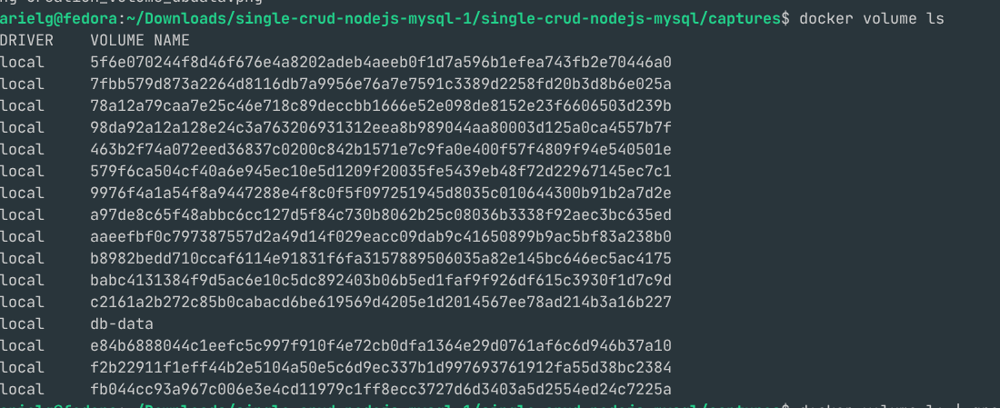
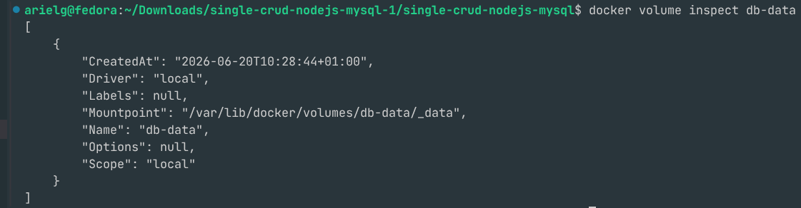

**Lancement des conteneurs**

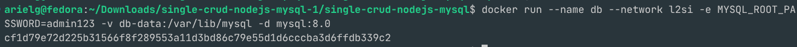
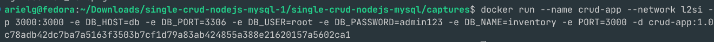
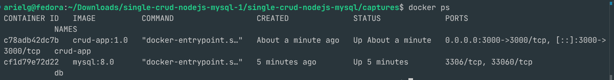
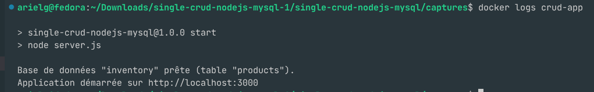
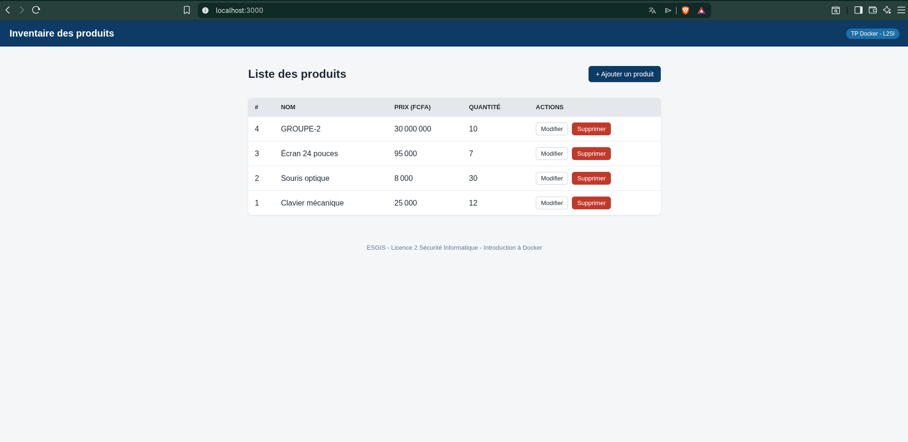

**Nettoyage, docker-compose et persistance**

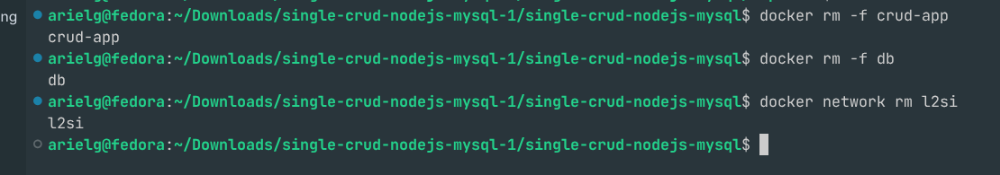
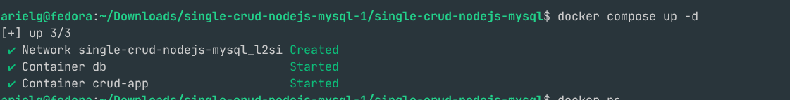
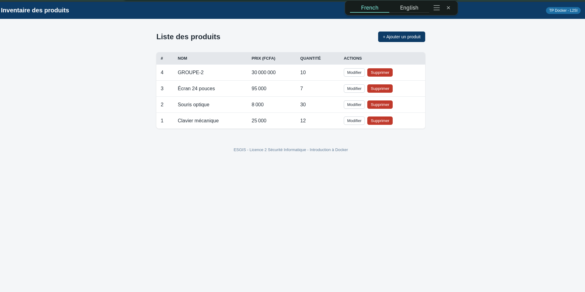

## Pistes d'amélioration

Ces points n'étaient pas demandés dans le TP, mais ils rendraient le projet plus sûr :

- Sortir le mot de passe MySQL du `docker-compose.yml` (mot de passe de test écrit en clair) vers un fichier `.env` non versionné.
- Faire tourner l'application avec un utilisateur non root (`USER node`) dans le `Dockerfile`.
- Copier `package*.json` avant le reste du code pour profiter du cache Docker lors de `npm install`.

## Structure du dépôt

```
.
├── README.md
└── single-crud-nodejs-mysql/
    ├── Dockerfile
    ├── docker-compose.yml
    ├── captures/            # captures demandées par le TP
    ├── server.js, config/, models/, controllers/, routes/, views/, public/
    └── README.md            # README fourni avec l'application
```
